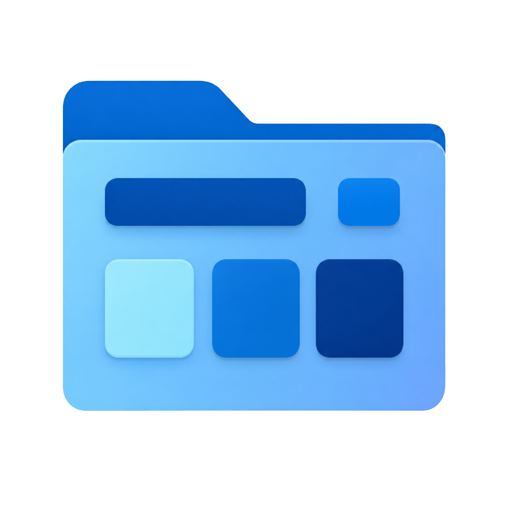
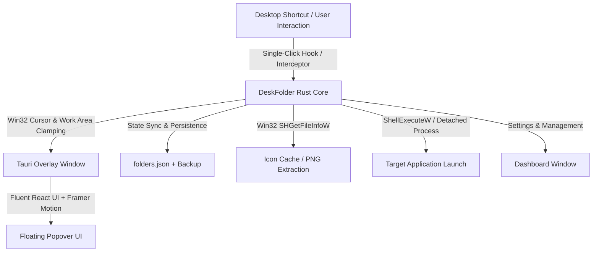

<div align="center">



# DeskFolder

**Mobile-style floating app folders for the Windows desktop.**

[](https://github.com/i-ayushsingh/Deskfolder/releases)
[](LICENSE)
[](https://github.com/i-ayushsingh/Deskfolder)
[](https://tauri.app/)
[](https://www.rust-lang.org/)
[](https://react.dev/)

[Features](#-features) • [Quick Start](#-quick-start) • [App Addition Methods](#-4-ways-to-add-apps) • [Architecture](#-architecture--tech-stack) • [Building](#-building-from-source) • [Contributing](#-contributing)

</div>

---

Windows desktop folders are clunky — double-clicking one rips open a full-screen File Explorer window that clutters your workspace and disrupts your focus.

**DeskFolder** brings the fluid, mobile-style **"App Folder"** experience (inspired by iOS home screen groups and Android app drawers) natively to Windows: a sleek, floating acrylic popover that appears right below your desktop icon with **instant single-click app launching**.

---

## ✨ Features

- 📱 **Mobile-Style Desktop Popovers**: Click any group icon on your desktop to trigger a lightweight floating popover right at your cursor position.
- ⚡ **Instant Single-Click Launch**: Launch apps directly with zero delay and detached process execution.
- 🎨 **Windows 11 Native Fluent Dark Theme**: Genuine DWM acrylic blur, native drop shadows, and clean rounded geometry.
- 🔍 **In-Popover Live Search**: Real-time search in large folder popovers ($\ge 5$ apps) for immediate keyboard navigation.
- 🖼️ **High-Res Win32 Icon Extractor**: Automatic 32-bit icon extraction for `.exe` and `.lnk` files with crisp high-DPI scaling.
- 🔄 **Smart Sorting Modes**:
  - **Manual (Custom)**: Reorder apps freely via drag-and-drop.
  - **Recently Launched (MRU)**: Dynamically sorts your most recently and frequently used apps to the top.
  - **Alphabetical (A to Z)**: Clean alphabetical sorting.
- ⚙️ **Deep Group Customization**:
  - **Desktop Preview Grids**: Choose between **2x2 Grid (4 apps preview)** and **3x3 Grid (9 apps preview)**.
  - **Dynamic Layouts**: Configure 3, 4, 5, or 6 column grid widths.
  - **Labels & Headers**: Toggle group title headers and app text labels to fit minimal or detailed setups.
- 🗂️ **Dashboard Power Tools**:
  - **Drag-to-Reorder Group Cards**: Smooth `@dnd-kit` drag-and-drop card reordering with persistent disk synchronization.
  - **Reveal in Explorer**: Right-click any app tile to reveal the target binary directly in Windows File Explorer.
  - **1-Click Shortcut Repair**: Live health validation of targets and desktop shortcuts with one-click automatic repair.
  - **JSON Backup Export & Import**: Backup your entire configuration to JSON and restore in one click.
  - **Windows 11 Toast Notifications**: Clean bottom-right toast notifications for feedback.
- 🛡️ **Robust Persistence & Safety**:
  - Deterministic ID-keyed shortcuts prevent broken links and naming collisions.
  - Atomic file swaps with `.bak` recovery safeguard against crashes or power loss.
  - Global Error Boundary protects against UI exceptions with user-friendly recovery.

---

## 📥 4 Ways to Add Apps

DeskFolder provides four intuitive methods to populate your folders:

| Method | Description |
|---|---|
| 🔍 **Installed Apps Scanner** | Automatically scans your Windows Start Menu (%ProgramData% and %LocalAppData%) and caches all apps with real icons. Includes a search-as-you-type picker and a 1-click **Rescan** button. |
| 🗂️ **Drag & Drop from Explorer** | Drag `.exe` or `.lnk` shortcuts directly from Windows File Explorer onto the Add Dialog, Group Card, or Popover for instant addition. |
| 📋 **Paste from Clipboard** | Copy any executable path and click **Paste Path** or hit `Ctrl+V` — DeskFolder automatically derives the application name and extracts its high-res icon. |
| 🔁 **Copy from Another Folder** | Duplicate existing apps across different folders with a single click without searching or browsing again. |

---

## 🏗️ Architecture & Tech Stack



| Layer | Technology | Purpose |
|---|---|---|
| **App Framework** | [Tauri v2](https://tauri.app/) | Ultra-lightweight Rust backend with web frontend host |
| **Frontend UI** | [React 18](https://react.dev/) + [TypeScript](https://www.typescriptlang.org/) | Type-safe modular components |
| **Styling** | [Tailwind CSS 3](https://tailwindcss.com/) | Windows 11 Fluent Dark design system tokens |
| **Animations** | [Framer Motion](https://www.framer.com/motion/) | Smooth spring physics & fluid transitions |
| **Drag & Drop** | [@dnd-kit](https://dndkit.com/) | Reordering apps and dashboard group cards |
| **System Integrations** | Win32 API (`windows-rs`) | Multi-monitor DPI clamping, single-click hook, icon extraction, detached process execution |
| **Shortcut Engine** | `lnks` | Deterministic `.lnk` creation and resolution |
| **Packaging** | NSIS + WiX MSI | Branded Windows setup installer & uninstaller |

---

## 🚀 Quick Start

### Download Pre-built Installer
Download the latest **NSIS Setup Installer (`.exe`)** or **MSI Package** from [GitHub Releases](https://github.com/i-ayushsingh/Deskfolder/releases).

1. Run `DeskFolder_0.1.0_x64-setup.exe` to install.
2. Launch **DeskFolder** from your Start Menu or Desktop.
3. Click **"+" (Add New Group)** to create your first desktop folder.
4. Add your favorite apps via Start Menu search, drag-and-drop, or clipboard paste.
5. Click your new desktop folder icon anytime to open the floating popover!

---

## 🔨 Building from Source

### Prerequisites
1. **Rust** (stable 1.77.2+): [rustup.rs](https://rustup.rs/)
2. **Node.js** (20+ LTS): [nodejs.org](https://nodejs.org/)
3. **Microsoft C++ Build Tools** (Visual Studio Installer with "Desktop development with C++")
4. **WebView2 Runtime** (Preinstalled on Windows 10/11)

### Steps

```powershell
# 1. Clone the repository
git clone https://github.com/i-ayushsingh/Deskfolder.git
cd Deskfolder

# 2. Install dependencies
npm install

# 3. Run backend tests (15 unit and integration tests)
cd src-tauri
cargo test
cd ..

# 4. Start in development mode (with hot-reloading)
npm run tauri:dev

# 5. Build production release and NSIS/MSI installers
npm run tauri:build
```

Installer packages are generated under `src-tauri/target/release/bundle/`:
- `nsis/DeskFolder_0.1.0_x64-setup.exe` — Branded NSIS installer with uninstaller
- `msi/DeskFolder_0.1.0_x64_en-US.msi` — Windows MSI installer

---

## 🤝 Contributing

Contributions, bug reports, and feature suggestions are welcome!
- Check out open issues on our [Issues page](https://github.com/i-ayushsingh/Deskfolder/issues).
- Read the [Contributing Guide](CONTRIBUTING.md) to set up your development environment.
- Review our [Security Policy](SECURITY.md) for vulnerability disclosures.

---

## 📄 License

This project is licensed under the [MIT License](LICENSE).

---

<div align="center">
  Crafted with ❤️ by <a href="https://github.com/i-ayushsingh">Ayush Singh</a>
</div>
